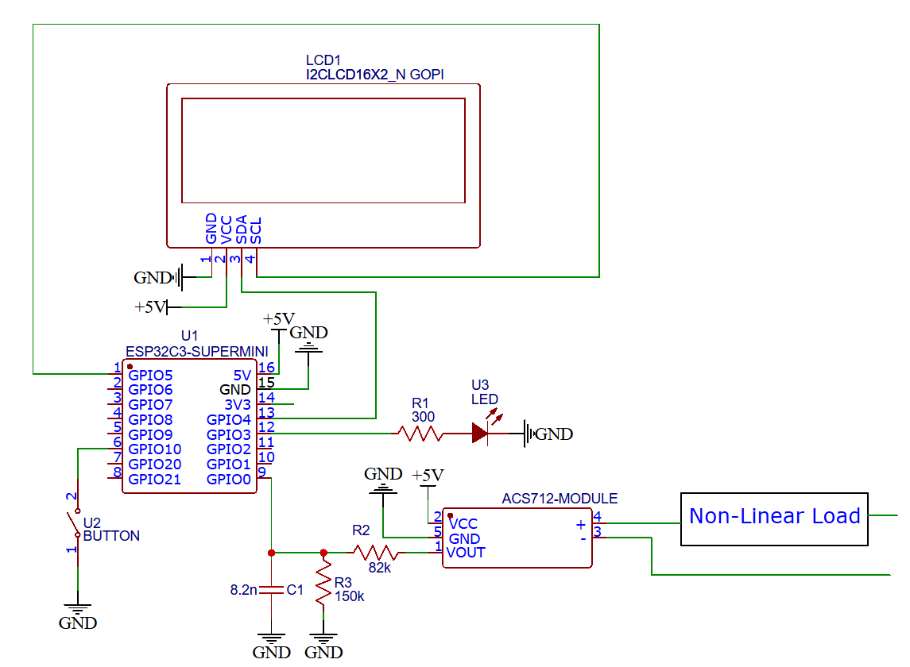

# ESP32-C3 Current THD Analyzer

## About

A real-time electrical current analyzer based on the ESP32-C3 microcontroller. Built as an academic project for the Microprocessors course (EEL7035), Universidade Federal de Santa Catarina (UFSC), this firmware captures analog signals from an ACS712 sensor, processes the True RMS and DC components, and computes the Total Harmonic Distortion of Current using a custom-built Fast Fourier Transform (FFT) algorithm.

## Key Features

- Real-Time DSP: Native C implementation of the Cooley-Tukey Radix-2 FFT algorithm, optimized for the RISC-V architecture (without hardware FPU).

- Power Quality Metrics: Calculates DC component, True RMS AC current, and THD-i (%) by analyzing the first 15 harmonics of a 60Hz grid.

- Robust RTOS Architecture: Fully driven by FreeRTOS. Utilizes priority-based task scheduling, binary semaphores for sequential execution (avoiding race conditions), and hardware timer interrupts for deterministic sampling (Fs = 7680 Hz).

- Signal Conditioning: Implements Hann Windowing to mitigate spectral leakage and software Deadband filtering to eliminate ADC quantization noise and thermal noise accumulation on RMS calculations.

- Human-Machine Interface (HMI): I2C 16x2 LCD integration for real-time monitoring, hardware debounced push-button for screen navigation, and programmable LED alarms for high THD detection (e.g., THD > 20%).

## Hardware Schematic

Below is the electrical schematic of the project, including the voltage divider for ADC protection and the anti-aliasing low-pass filter:



Hardware Components:

Microcontroller: ESP32-C3 Super Mini (RISC-V)

Current Sensor: ACS712 Module (5A version)

Display: 16x2 LCD with PCF8574 I2C Expander

Analog Front-End: Voltage divider (82kΩ and 150kΩ) to step down the 5V sensor output to the 3.3V ESP32 ADC limit.

RC Low-Pass Filter: An 8.2nF capacitor (C1) in parallel with the divider.

## System Architecture

The firmware abandons the traditional super-loop paradigm in favor of a strictly preemptive RTOS model, divided into three main tasks:

Sampling Task (Highest Priority): Awakened by a highly deterministic hardware timer interrupt (gptimer) every 130µs. It reads the ADC to fill a 512-point buffer spanning exactly 4 cycles of a 60Hz signal.

Processing Task (Medium Priority): Translates ADC values to Amperes, extracts the DC offset, applies the Hann window, runs the Radix-2 FFT, and calculates both RMS and THD-i.

Display Task (Lowest Priority): Handles the high-latency I2C communication to update the LCD without blocking critical ADC reads.

## How to Build and Flash

This project is built using the official ESP-IDF framework.

Clone the repository:
```bash
git clone [https://github.com/eduardoBorgonha/thd-current-esp32c3.git](https://github.com/eduardoBorgonha/thd-current-esp32c3.git)
```

Set up the ESP-IDF environment in your terminal (or via the VS Code extension).

Build the project:
```bash
idf.py build
```

Flash to the ESP32-C3 and open the monitor:
```bash
idf.py -p PORT flash monitor
```

## Authors

Eduardo Borgonha Lopes

Mateus Gonçalves dos Santos


